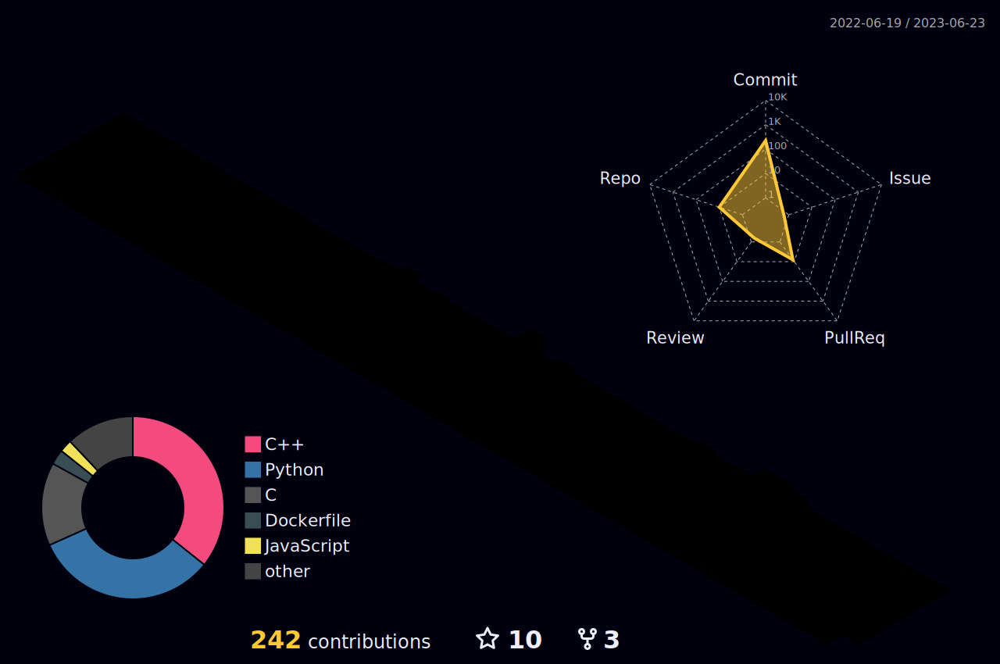

* 🔭 I am conducting research and performing sample works on ML and DL projects.
* 🤖 I have worked on and continue to work on autonomous driving of ground vehicles.
* 👨‍🎓 Computer Engineering in Kocaeli University - 4
* 🔎 Ask me about Ecole 4️⃣2️⃣
* 📭 How to reach [me](https://www.linkedin.com/in/denizkarhan/)

   
  

   
<h2> Ecole 42 </h2>

   
   | Project | Score | Project | Score |
   | :---: | :---: | :---: | :---: |
   | `libft` |  | `get_next_line` |  |
   | `ft_printf` |  | `Born2beroot` |  |
   | `push_swap` |  | `minitalk` |  |
   | `fract-ol` |  | `Philosophers` |  |
   | `minishell` |  | `NetPractice` |  |
   | `CPP Module 00` |  | `CPP Module 01` |  |
   | `CPP Module 02` |  | `CPP Module 03` |  |
   | `CPP Module 04` |  | `CPP Module 05` |  |
   | `CPP Module 06` |  | `CPP Module 07` |  |
   | `CPP Module 08` |  | `CPP Module 09` |  |
   | `cub3d` |  | `Inception` |  |
   | `ft_irc` |  | `ft_transcendence` |  |
   | `ft_linear_regression` |  |

<h3 align="left">Languages and Tools</h3>

 

